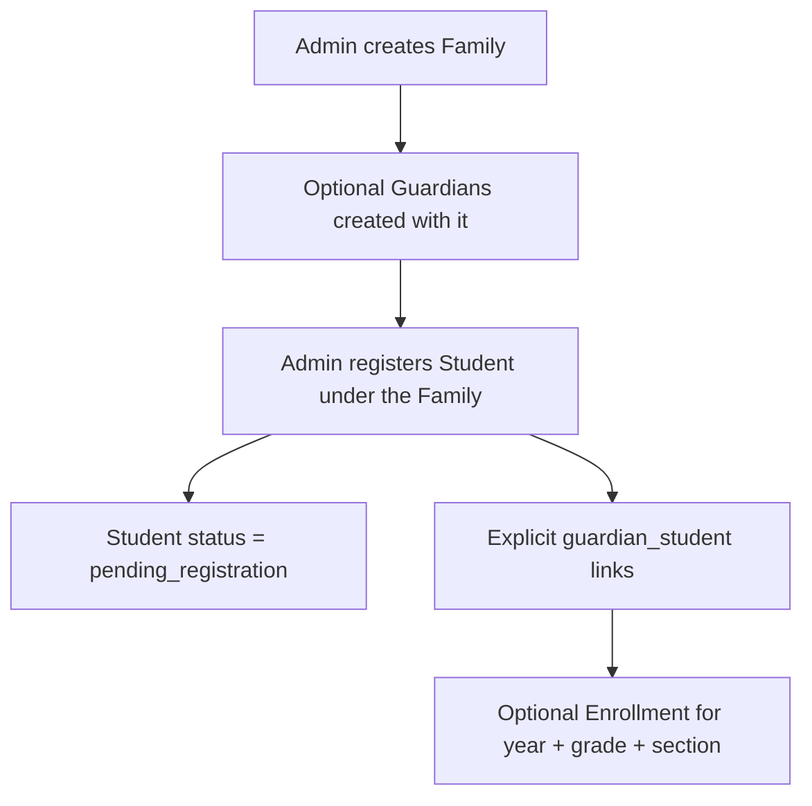
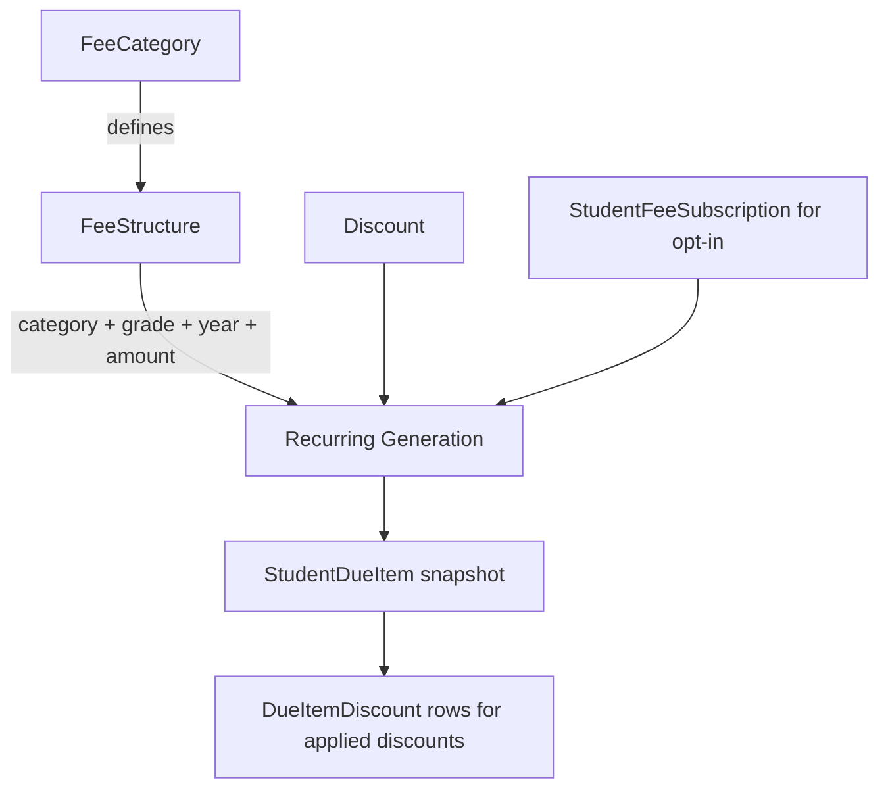
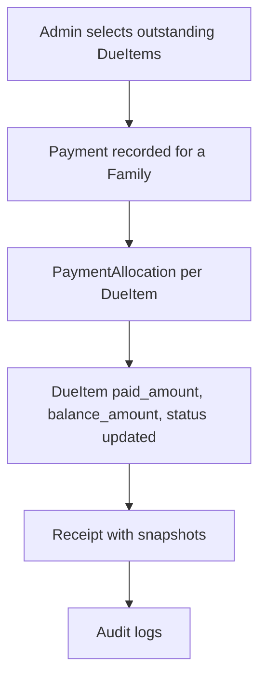
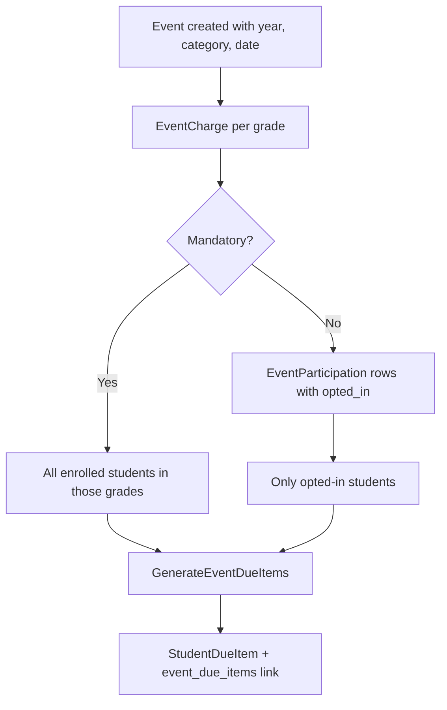
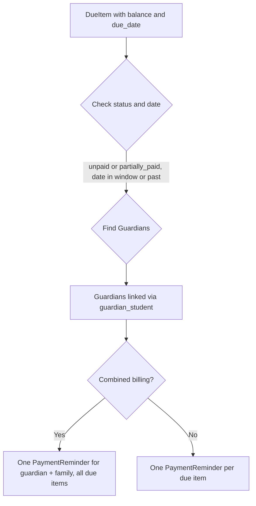
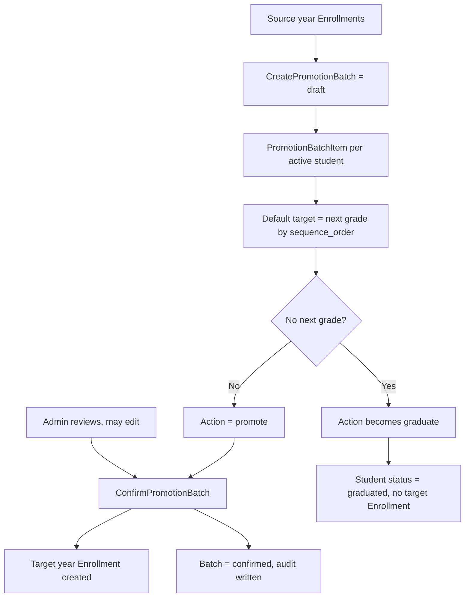

# Skooly Data Flow

This document explains how data moves through Skooly, step by step, and the safety
rules that protect money and student privacy.

## Registration flow

How a household and its students get into the system.

1. `CreateFamily` creates the Family and, optionally, Guardians. **Guardians are not
   linked to any student at this point.**
2. `RegisterStudent` creates the Student with status `pending_registration`.
3. The caller passes explicit Guardian IDs. Only those are linked through
   `guardian_student`.
4. Optionally an `Enrollment` is created for the academic year, grade, and section.

Example: a family has a mother and a father and two children. The mother is linked to
both children; the father is linked only to the older child. The younger child is
invisible to the father.

## Fee flow

How a charge becomes an amount owed.

1. A `FeeCategory` states what can be charged and whether it recurs or is opt-in.
2. A `FeeStructure` sets the amount for one category, one grade, one academic year,
   one frequency.
3. `GenerateRecurringDueItems` finds recurring structures for the year, matches
   students by enrollment, and checks opt-in subscriptions.
4. The student's active, in-date-range discounts are applied and clamped so the net
   amount never goes below zero.
5. One `StudentDueItem` is written per student, with the amount **snapshotted**.
6. `DueItemDiscount` rows record exactly which discount produced which reduction.

Because amounts are snapshots, editing a `FeeStructure` later never rewrites a due
item that already exists.

## Payment flow

How money received settles what is owed.

1. The Admin picks which due items to settle and how much to put against each.
2. `Payment::recordManual` validates that the allocations total exactly the payment
   amount, and that no allocation exceeds that due item's balance.
3. Inside one database transaction it creates the `Payment`, the `PaymentAllocation`
   rows, updates each `StudentDueItem`, and creates the `Receipt`.
4. `payment_recorded` and one `payment_allocation_recorded` per allocation are audited
   in the same transaction.

If anything fails, the whole thing rolls back: no payment, no allocations, no receipt,
no audit entries, and no balance changes.

## Event flow

How a one-off school event becomes a charge.

1. The Admin creates the Event and adds at least one per-grade `EventCharge`.
2. For a mandatory event, every student enrolled in the charge grade is charged.
3. For an opt-in event, only students with an `opted_in` participation row are charged.
4. `GenerateEventDueItems` creates `StudentDueItem` rows and links them back to the
   Event through `event_due_items`.

Creating or editing an Event never generates dues. Generation is always a separate,
deliberate step.

## Reminder flow

How a "tell the guardian" record is produced.

1. `GeneratePaymentReminders` selects due items with a balance, an unpaid or
   partially paid status, and a due date inside the upcoming window or already past.
2. For each due item it finds the Guardians **linked to that student**.
3. Combined-billing families get one consolidated record per guardian holding every
   due item id. Others get one record per due item.
4. The record stores a `message_snapshot` with the family, guardian, total balance,
   and each due item.

**Nothing is sent.** These are outbox rows only.

## Promotion flow

How students move to the next year.

1. `CreatePromotionBatch` creates a **draft**. It never changes a student or an
   enrollment. It lists only **active** students.
2. Each item gets a default target grade (the next grade by `sequence_order`) and the
   same-named section in that grade. If there is no next grade, the action becomes
   `graduate`.
3. `ConfirmPromotionBatch` runs in one transaction. It creates target-year
   enrollments, marks graduates, and skips excluded students. Source-year enrollments
   are never modified.
4. If any item is invalid, the whole confirmation rolls back and the batch stays a
   draft.

Promotion **never** creates fee items for the next year.

## Safety rules worth remembering

### Guardian access comes only from `guardian_student`

Being in the same family grants nothing. A guardian sees only students they are
explicitly linked to, and only due items for those students. This holds even when the
family has combined billing enabled.

### Payments are manual allocation only

There is no automatic strategy: no even split, no oldest-first, no waterfall. The
Admin decides how each unit of money is applied. This is a deliberate deferral of an
unresolved product decision.

### Receipts and discount snapshots are immutable

A receipt stores a copy of the family, payment, and allocation values at the time of
payment. Later changing a due item, a family, or a payment does not rewrite the
receipt.

### Promotion creates no due items

Promoting a student creates an enrollment and nothing else. The new academic year
starts with no fees until generation is run.

### Event management generates no dues

Creating an event, adding charges, or assigning participants writes only event
records. Dues appear only when generation is triggered.

### Reminders send nothing

Reminder records are internal. There is no email, SMS, or WhatsApp provider.

### Generation is idempotent

Recurring dues, event dues, and reminders all use a deterministic key. Running the
same generation twice for the same cycle changes nothing.

### Nothing is deleted through the web UI

There are no delete routes. Historical and financial tables also use
`restrictOnDelete` foreign keys, so the database refuses to orphan money records even
if a delete is attempted outside the application.
